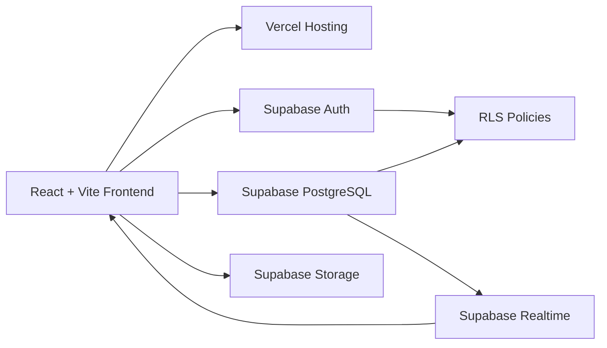
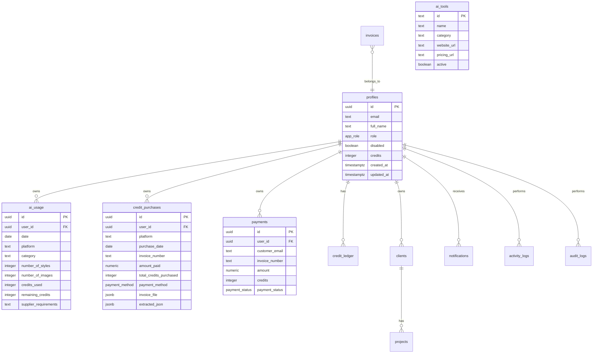

# Zeal Design Studio Production Supabase Architecture

## Recommendation

Use **Supabase Auth + Supabase PostgreSQL + Supabase Storage + Supabase Realtime** as the single production backend.

Firebase Auth has been removed from the application runtime. Keeping Firebase Auth while using Supabase for data would require custom JWT verification, duplicated user identity, extra authorization mapping, and more failure points. Supabase Auth is the cleaner production choice because PostgreSQL Row Level Security can read `auth.uid()` directly, realtime subscriptions share the same authorization model, and the frontend only needs the publishable Supabase key.

## Architecture Diagram



## Database ER Diagram



## Migration Scripts

Primary migration:

- `supabase/migrations/202607090001_production_schema.sql`

It creates:

- PostgreSQL enums for roles, payment methods, and statuses.
- Normalized tables for profiles, roles, clients, projects, invoices, payments, credit purchases, AI usage, AI tools, settings, notifications, activity logs, audit logs, suppliers, categories, and credit ledger.
- UUID primary keys and foreign keys.
- Indexes for user, date, platform, invoice number, email, and realtime-heavy queries.
- `created_at` and `updated_at` timestamps.
- Auth user profile bootstrap trigger.
- Audit logging triggers.
- Supabase Realtime publication entries.
- Supabase Storage buckets and policies.

## RLS Summary

Roles:

- `super_admin`
- `admin`
- `manager`
- `employee`
- `customer`

Admin roles are `super_admin`, `admin`, and `manager`.

Policies:

- Profiles: users can read their own profile; admins can read/update all.
- AI usage: users can CRUD their own usage; admins can access all.
- Credit purchases and payments: users can read their own records; admins can write/manage all.
- AI tools: authenticated users can read active tools; admins can manage tools.
- Settings, notifications, activity logs, audit logs: restricted by role and ownership.
- Storage: authenticated users can access their own folder; admins can manage all files.

Promotion step after the owner signs up:

```sql
update public.profiles
set role = 'super_admin'
where email = 'niyas.zealdesigner@gmail.com';
```

## SQL Verification Queries

Verify latest admin updates exist:

```sql
select id, platform, invoice_number, total_credits_purchased, updated_at
from public.credit_purchases
order by updated_at desc
limit 20;
```

Verify user-visible usage rows:

```sql
select id, user_id, platform, category, credits_used, updated_at
from public.ai_usage
where user_id = '<USER_UUID>'
order by updated_at desc;
```

Verify RLS visibility as an authenticated user in Supabase SQL editor by setting JWT claims in the policy simulator, then testing:

```sql
select * from public.credit_purchases;
select * from public.ai_usage;
select * from public.ai_tools where active = true;
```

Verify realtime publication:

```sql
select schemaname, tablename
from pg_publication_tables
where pubname = 'supabase_realtime'
order by tablename;
```

Verify storage buckets:

```sql
select id, name, public, file_size_limit, allowed_mime_types
from storage.buckets
where id in ('invoices', 'documents', 'images');
```

## Folder Structure

```text
src/
  components/
    ai-studio/
    ui/
  lib/
    ai-tools.ts
    constants.ts
    data-store.ts
    invoice-extractor.ts
    supabase.ts
    types.ts
supabase/
  migrations/
    202607090001_production_schema.sql
docs/
  production-supabase-architecture.md
```

## Files Modified

- `package.json`
- `package-lock.json`
- `.env.example`
- `.env.local`
- `vite.config.ts`
- `src/App.tsx`
- `src/components/ai-studio/ai-studio-page.tsx`
- `src/lib/data-store.ts`
- `src/lib/supabase.ts`
- `src/lib/types.ts`
- `src/lib/firebase.ts` removed
- `supabase/migrations/202607090001_production_schema.sql`
- `docs/production-supabase-architecture.md`

## Supabase Setup Checklist

1. Create a Supabase project.
2. Enable Email/Password auth and any OAuth providers needed.
3. Add authorized redirect URLs for local and Vercel domains.
4. Run `supabase/migrations/202607090001_production_schema.sql`.
5. Sign up the owner account.
6. Promote the owner:

   ```sql
   update public.profiles
   set role = 'super_admin'
   where email = 'niyas.zealdesigner@gmail.com';
   ```

7. Confirm RLS is enabled on every business table.
8. Confirm realtime contains `profiles`, `credit_purchases`, `payments`, `ai_usage`, and `ai_tools`.
9. Confirm storage buckets exist: `invoices`, `documents`, `images`.
10. Add frontend environment variables.
11. Test login, usage CRUD, purchase CRUD, payments, reports, and AI Studio.
12. Deploy to Vercel.

## Environment Variables

Local and Vercel:

```bash
VITE_SUPABASE_URL=https://wvlcobyuraxrolqabfop.supabase.co
VITE_SUPABASE_PUBLISHABLE_KEY=your-publishable-or-anon-key
```

Never expose the Supabase secret/service role key in Vite or browser code.

## Production Checklist

- Supabase migration applied.
- First super admin promoted by SQL.
- RLS policies verified for admin and user accounts.
- Realtime enabled on business tables.
- Vercel environment variables configured.
- Vercel Node runtime set to Node 22 because `pdfjs-dist` requires `>=22.13.0`.
- OAuth redirect URLs configured in Supabase Auth.
- Storage buckets and policies verified.
- No business data stored in localStorage.
- Build runs with `npm run build`.

## Security Checklist

- Service role key is not present in frontend code.
- RLS enabled on every business table.
- Admin privileges come from database roles, not frontend email checks.
- Users can only read their own private records unless admin.
- Storage access is scoped by user folder or admin role.
- Inputs are validated in the UI and constrained in PostgreSQL.
- Audit logs capture inserts, updates, and deletes.
- Duplicate payment IDs, transaction IDs, and invoice numbers are blocked for payments.

## Performance Checklist

- Indexed user, email, date, platform, and invoice queries.
- Realtime subscriptions scoped to business tables.
- Vite chunks split for Supabase, React, charts, PDF reports, and OCR extraction.
- Reports and invoice extraction libraries are separated from the main app chunk.
- Pagination should be added next for very large tables.

## Deployment Checklist

- Set `VITE_SUPABASE_URL` in Vercel.
- Set `VITE_SUPABASE_PUBLISHABLE_KEY` in Vercel.
- Do not set service role key in frontend project variables.
- Set Vercel Node.js version to 22.
- Run `npm run lint`.
- Run `npm run build`.
- Deploy.
- Verify production login and realtime update flow.

## Final Test Report

Local verification completed:

- `npm uninstall firebase`: completed.
- `npm run lint`: passed.
- `npm run build`: passed.
- Firebase runtime module removed.
- Supabase client configured.
- Supabase-backed CRUD layer implemented.
- Realtime subscriptions wired into dashboard, purchases, usage, reports, payments, and AI Studio.
- Production SQL migration generated.

Not executed locally:

- Applying the migration to the live Supabase project.
- Verifying live RLS with real user JWTs.
- Verifying live Vercel environment variables.

